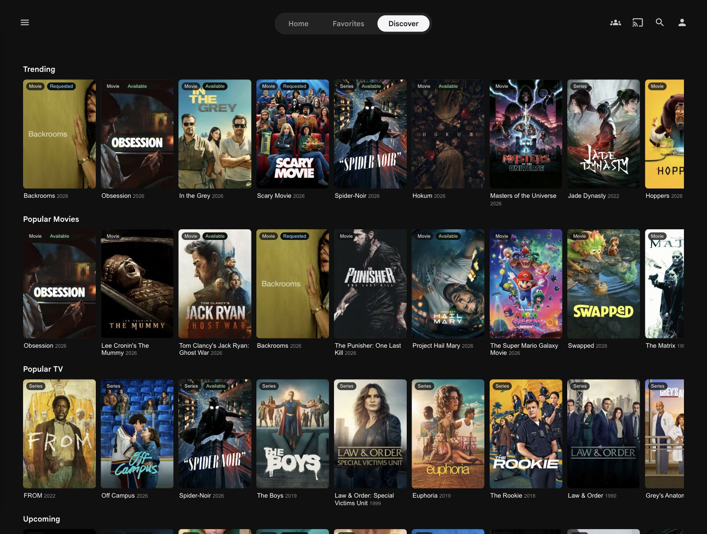
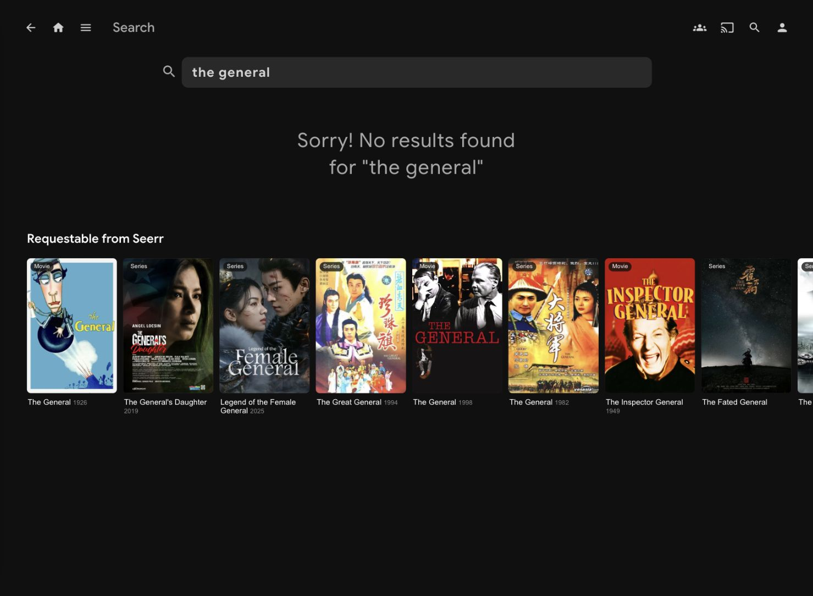
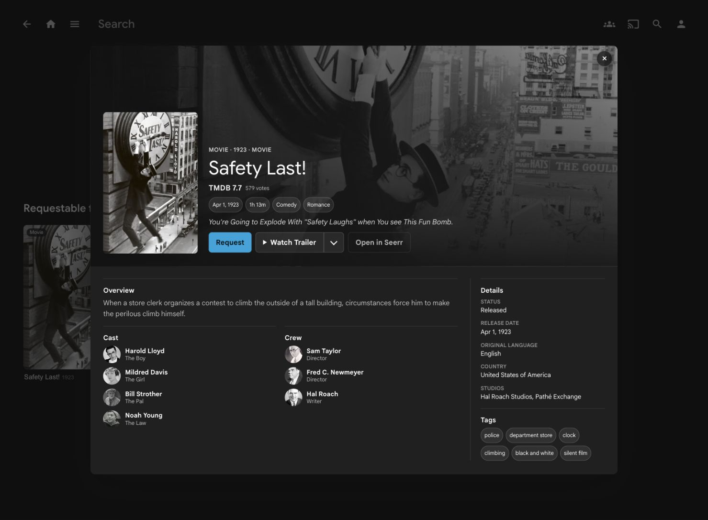
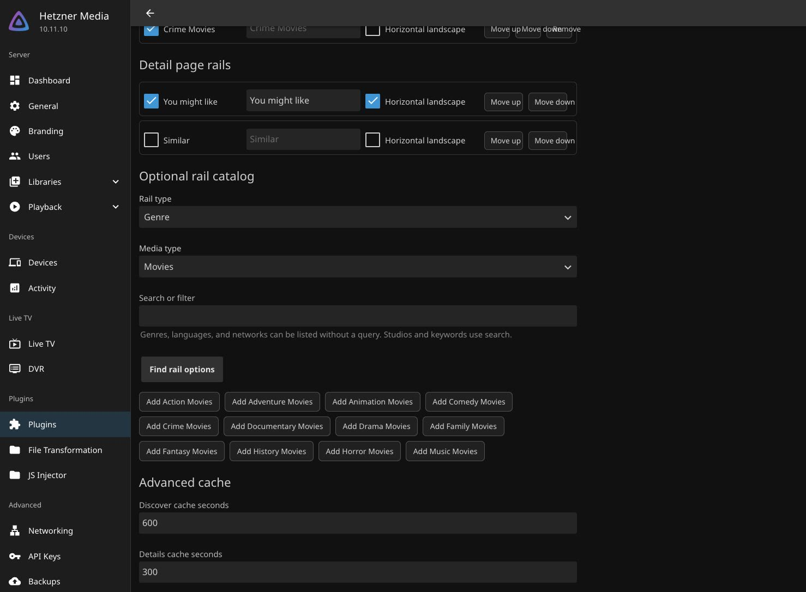

# Jellyfin Seerr Discover

Seerr Discover is a Jellyfin server plugin that adds Seerr-backed Discover rails and requestable Seerr results inside Jellyfin's native search page. Browser code calls Jellyfin-authenticated plugin endpoints for Seerr traffic; the Seerr API key stays on the Jellyfin server.

## Status

Seerr Discover is distributed as a stable third-party Jellyfin plugin through a self-hosted Jellyfin plugin repository. The `0.3.x` line is the supported release line for repository installs.

Repository URL:

```text
https://omgwtfwow.github.io/jellyfin-plugin-seerr-discover/manifest.json
```

## Quick Start

1. Add the repository URL in Jellyfin: Dashboard > Plugins > Repositories.
2. Install Seerr Discover from Dashboard > Plugins > Catalog, then restart Jellyfin.
3. Configure Seerr Discover with your internal Seerr URL, public Seerr URL, and Seerr API key.
4. Install and configure the companion plugins using the copy-paste setup below.
5. Hard-refresh Jellyfin Web or restart the client app.
6. Use Jellyfin's normal search page for Seerr search results; use the Discover tab for browse rails.

## Companion Plugin Setup

The server plugin provides the Jellyfin API proxy and browser asset. Custom Tabs creates the `Discover` tab, and JavaScript Injector loads the asset. File Transformation may also be required by your JavaScript Injector installation.

1. Install Custom Tabs, JavaScript Injector, and File Transformation if your JavaScript Injector install requires it.
2. In Custom Tabs, add a tab named `Discover` and paste this content:

   ```html
   <div class="sections"><div id="seerrDiscoverRoot"></div></div>
   ```

3. In JavaScript Injector, add an authenticated JavaScript entry and paste this loader:

   ```js
   (function () {
     if (document.getElementById('seerr-discover-loader')) return;
     var script = document.createElement('script');
     script.id = 'seerr-discover-loader';
     script.defer = true;
     script.src = '/SeerrDiscover/assets/discover.js';
     document.head.appendChild(script);
   }());
   ```

4. Save the companion plugin settings, restart Jellyfin if the plugin manager asks, then hard-refresh Jellyfin Web.
5. Confirm the `Discover` tab appears. Native Jellyfin search should also show a `Requestable from Seerr` row when Seerr has matching results.

See [Companion Plugins](docs/COMPANION-PLUGINS.md) for repository sources, compatibility notes, and troubleshooting.

## Screenshots

These screenshots were captured from a live Jellyfin Web session and show the plugin UI without configuration pages or API secrets.

| Discover rails | Native search integration |
| --- | --- |
|  |  |

| Detail modal | Mobile layout |
| --- | --- |
|  |  |

| Optional rail catalog |
| --- |
|  |

## Requirements

- Jellyfin Server `10.11.x`; current releases target `targetAbi: 10.11.10.0`
- Seerr reachable from the Jellyfin server
- Seerr API key
- Seerr Jellyfin user import/mapping enabled for request creation
- Custom Tabs plugin
- JavaScript Injector plugin
- File Transformation plugin, if required by your JavaScript Injector installation

Custom Tabs and JavaScript Injector are intentional dependencies for the v1 UI surface. The server plugin provides the API proxy and web asset; Custom Tabs provides the Jellyfin Web mount point.

## Features

- Rails-only Discover tab for configurable Trending Movies, Trending TV, Popular Movies, Popular TV, Upcoming Movies, and Upcoming TV rows
- Optional admin-selected rails for genres, movie studios, TV networks, original languages, and keywords
- Requestable Seerr movie and series results inside Jellyfin's native search page
- Detail modal with poster/backdrop, metadata, cast/crew, trailers, and Seerr links
- Request creation as the mapped Seerr user
- Available/requested/requestable state badges
- Watch Now and Open Details handoff for available Jellyfin items
- Theme-aware Jellyfin Web styling with native Jellyfin class hooks for Custom CSS themes
- Discover tab spacing follows Jellyfin Web/client layout classes and active theme CSS at runtime
- Server-side cache for discover, details, search, and mapped user lookups

## Compatibility

| Client or surface | Status | Notes |
| --- | --- | --- |
| Jellyfin Web | Supported | Primary target. Discover spacing is computed from Jellyfin Web's active page/header CSS. |
| Jellyfin Desktop | Supported through Jellyfin Web UI | Hard refresh or client restart may be required after loader changes. Verify spacing in the app, not only a resized browser window. |
| Jellyfin mobile apps | Best effort through embedded web UI | Mobile webviews can use different Jellyfin layout classes and header behavior; verify Discover after app restart. Trailer handoff behavior depends on the client/webview. |
| Android TV and native TV clients | Not supported | These clients do not expose the custom Jellyfin Web tab surface. |

## Installation and Setup

See [docs/INSTALL.md](docs/INSTALL.md).

See [docs/TROUBLESHOOTING.md](docs/TROUBLESHOOTING.md) if the plugin does not appear, the Discover tab is blank, or the client needs a cache refresh.

## Configuration

Open Jellyfin Dashboard > Plugins > Seerr Discover.

Most installs only need the Seerr URLs, Seerr API key, companion plugin setup, and the default rail choices. The optional rail catalog can add opt-in Discover rows by genre, movie studio, TV network, original language, or keyword. Genres, languages, and networks can be listed without a query; studios and keywords use search. Added optional rails can be enabled, disabled, or removed before saving.

| Setting | Default | Meaning |
| --- | --- | --- |
| Seerr base URL | `http://seerr:5055` | Internal URL Jellyfin uses to call Seerr. |
| Seerr public URL | blank | Browser URL used by Open in Seerr links. |
| Seerr API key | blank | Write-only server-side key; leaving the field blank preserves a stored key. |
| Language | `en` | Language passed to Seerr/TMDB-backed endpoints. |
| Discover cache seconds | `600` | Cache TTL for Discover rail responses. |
| Details cache seconds | `300` | Cache TTL for detail modal responses. |
| Search cache seconds | `60` | Cache TTL for native search integration. |
| User cache seconds | `60` | Cache TTL for mapped-user and quota lookups. |
| Require mapped Seerr users | On | Requests must be created as the mapped Seerr user. |
| Show Seerr results in Jellyfin search | On | Adds Seerr results to Jellyfin's native search page. |
| Default 4K requests | Off | Creates 4K requests by default when enabled. |
| Trending Movies rail | On | Shows Seerr/TMDB trending movies. |
| Trending TV rail | On | Shows Seerr/TMDB trending series. |
| Popular Movies rail | On | Shows popular movies. |
| Popular TV rail | On | Shows popular series. |
| Upcoming Movies rail | On | Shows upcoming movies. |
| Upcoming TV rail | On | Shows upcoming series. |
| Recently Requested rail | Off | Shows recent request media only; requester details are stripped server-side. |
| Popular With This Server rail | Off | Dedupes recent server requests into media cards. |
| Similar titles on detail pages | Off | Adds similar-title rows inside Discover modals and native Jellyfin movie/series detail pages. |
| Recommended titles on detail pages | Off | Adds recommended-title rows inside Discover modals and native Jellyfin movie/series detail pages. |
| Optional rail catalog | none configured | Adds admin-selected genre, studio, network, language, or keyword rails. |

## Security

- Browser JavaScript is public, auditable client code. It is not a secret and must not contain Seerr API keys, Jellyfin tokens, or stored credentials.
- The Seerr API key is stored in Jellyfin plugin configuration and sent only from Jellyfin server code to Seerr.
- The browser asset calls `/SeerrDiscover/*` with Jellyfin authentication for Seerr traffic. Anonymous access to a JavaScript file is not anonymous access to Seerr data.
- The admin config page uses redacted plugin-owned endpoints so the stored API key is not written into the page.
- Request creation requires a mapped Jellyfin/Seerr user by default.
- Treat any browser network path that contains `X-Api-Key` or the stored Seerr API key value as a security bug.

## Development

```bash
dotnet restore Jellyfin.Plugin.SeerrDiscover.sln
dotnet test Jellyfin.Plugin.SeerrDiscover.sln
dotnet build Jellyfin.Plugin.SeerrDiscover/Jellyfin.Plugin.SeerrDiscover.csproj -c Release
node --check Jellyfin.Plugin.SeerrDiscover/Web/discover.js
bash -n scripts/package-plugin.sh scripts/generate-manifest.sh
shellcheck scripts/*.sh
```

Build a release zip:

```bash
scripts/package-plugin.sh
```

Generate a Jellyfin repository manifest for the built zip:

```bash
version="$(sed -n 's:.*<Version>\\(.*\\)</Version>.*:\\1:p' Directory.Build.props | head -n1)"
scripts/generate-manifest.sh \
  --base-url "https://github.com/omgwtfwow/jellyfin-plugin-seerr-discover/releases/download/v${version}"
```

## Support

When reporting issues, include:

- Jellyfin server version
- Seerr Discover version
- Custom Tabs, JavaScript Injector, and File Transformation versions
- Client type: browser, Jellyfin Desktop, iOS, Android, or other
- Redacted Jellyfin logs and browser console errors
